 

 

 

## `// boot_sequence`

 

## `// about.md`

- 🔭 **Building:** an AI-powered student assistant, aligned with the PBTE syllabus
- 🌱 **Learning:** Node.js, Express, TypeScript, backend dev, Mandarin Chinese
- 👯 **Want to collab on:** AI/ML projects, web dev, DSA study groups
- 🤝 **Need help with:** ML fundamentals, applied AI engineering
- 💬 **Ask me about:** Python, Java, JS, React, SQL, Data Structures & Algorithms
- ⚡ **Fun fact:** `git log` on my CodeChef would show more commits than my sleep schedule

<b>📖 Why I'm doing this — click to expand</b>

 

I'm two years into a Dual Diploma in Software Engineering (GCT-PGA Lahore × Shenzhen Institute of Information Technology), and I've spent a lot of that time heads-down in Data Structures & Algorithms — 1,000+ problems solved on CodeChef so far. That's given me the reasoning foundation, but not yet the real-world shipping experience.

Right now I'm looking for an internship where I can trade practice problems for production code — something live, used by real people, with real constraints. Long-term, I'm aiming at AI engineering; short-term, I want to get good at the fundamentals of working on an actual team.

 

## `// stack.json`

 

 

## `// stats.exe`

 

## `// contributions.snake`

 

<b>🎓 Certifications — click to expand</b>

 

- ✅ Data Structures & Algorithms (Basic & Intermediate) — CodeChef
- ✅ Java & Java Problem Practice — CodeChef
- ✅ SQL — CodeChef
- ✅ C Language & Practice Problems — CodeChef
- ✅ HTML/CSS & CSS Intermediate — CodeChef

 

## `// connect.sh`

 

Built line by line, same as everything else here.

