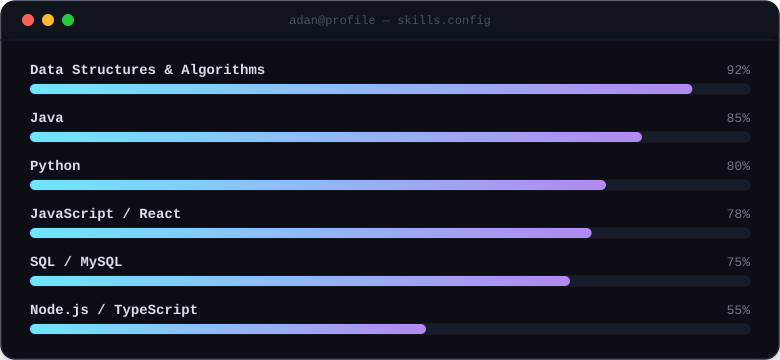

<h3 align="center">Software Engineering Student building toward AI | Lahore, Pakistan 🇵🇰</h3>

Dual Diploma SE Student (GCT-PGA Lahore × Shenzhen Institute of Information Technology, China).
Solved <strong>1,000+ DSA problems</strong> on CodeChef — now putting that foundation to work on real, live software.

  
  
  

---

### // about.md

- 🎓 **Building:** [AI Student Assistant](#) — An AI-powered study tool aligned with the PBTE (Punjab Board of Technical Education) syllabus
- 🌱 **Learning:** Node.js & Express, TypeScript, Pandas & Data Science, Backend Systems Architecture, Mandarin Chinese 🇨🇳
- 👯 **Want to collaborate on:** AI / ML Projects & Intelligent Agents, Full Stack Web Applications, DSA Problem Solving Study Groups
- 🤝 **Need help with:** Machine Learning Fundamentals, Applied AI Engineering & Vector Databases
- 💬 **Ask me about:** Python & Data Processing, Java & C Programming, JavaScript, React & Web Development, SQL Databases & Relational Schema Design, Data Structures & Algorithms (1,000+ solved)
- ⚡ **Fun fact:** I've solved 1,000+ DSA problems on CodeChef — git log on my profile shows more commits than my sleep schedule!

<b>📖 Why I'm doing this — click to expand</b>

 

My passion lies at the intersection of algorithmic efficiency and artificial intelligence. By combining rigorous Data Structures & Algorithms problem-solving with cutting-edge AI architectures, I aim to build impactful software systems that solve real educational and industry challenges.

---

### // stack.json

---

---

### // contributions.snake

  

---

<b>🎓 Certifications — click to expand</b>

 

- [x] **Data Structures & Algorithms (Basic & Intermediate)** — CodeChef
- [x] **Java & Java Problem Practice** — CodeChef
- [x] **SQL & Database Queries** — CodeChef
- [x] **C Language & Practice Problems** — CodeChef
- [x] **HTML/CSS & CSS Intermediate** — CodeChef

---

### // connect.sh

